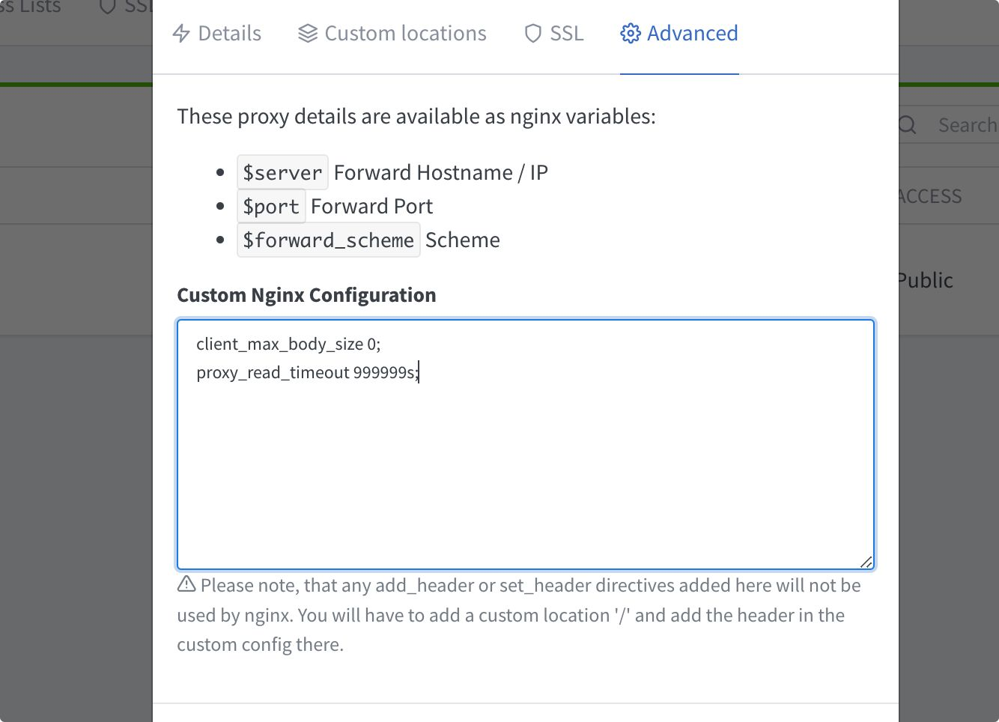

## docker分支一键部署

*NginxProxyManager+Fireshare+Filebrowser一键运行*
- NginxProxyManager: https加密和域名管理
- Fireshare: 处理媒体流和浏览器之间的交互
- Filebrower: 上传文件的组件

## 项目结构图
```
      NginxProxyManager ----(分配域名，https加密)----
                                                   |
                                                   |
  用户 ---> chrome --(观看视频)--> Fireshare <------|
              |                       |            |
              |                   (读取文件)        |
              |                       ↓            |
              ----(上传视频)----> Filebrowser <-----
```

## 部署步骤
- 下载项目架构
```
git clone -b docker https://github.com/Dawn-Inator/Fireshare.git&&cd Fireshare
```

- ubuntu系统
```
chmod +x ubuntu-docker.sh&&./ubuntu-docker.sh&&docker-compose up -d
```
- centos系统
```
chmod +x centos-docker.sh&&./centos-docker.sh&&docker-compose up -d
```

## 端口和登录说明
| 服务 | 端口 | 管理员账号 | 管理员密码 |
|:--- |:--- |:--- |:--- |
| NginxProxyManager | 81 | admin@example.com | changeme |
| Fireshare | 8080 | admin | admin |
| Filebrower | 5000 | admin | admin |

## 上传问题
- 上传问题通常是由把fireshare放在某种反向代理（如nginx）后面引起的。在默认情况下，nginx对你的上传大小有限制。如果你使用nginx，你可能需要添加这两行
```
client_max_body_size 0;
proxy_read_timeout 999999s;
```


## 播放问题
- 注意，fireshare播放只支持MP4，并且需要纯度高的MP4
- 意味着从网路上使用IDM或爬取器等下载的MP4可能播放失败
- 上传前建议先转换格式 

